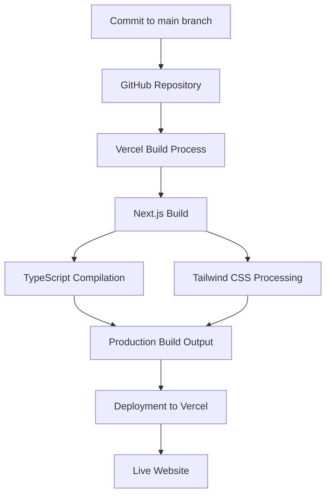

# Personal Website – alexandr-semizbayev.vercel.app

This repository contains the source code for my personal website, built to showcase my projects, skills, and experience.

🌐 Live site: https://alexandr-semizbayev.vercel.app

---

## ✨ Features

- Modern, responsive UI
- Built with Next.js and TypeScript
- Styled using Tailwind CSS
- Optimized for performance and SEO
- Automated deployment via Vercel

---

## 🛠 Tech Stack

- **Framework:** Next.js
- **Language:** TypeScript
- **Styling:** Tailwind CSS
- **Deployment:** Vercel
- **CI/CD:** GitHub + Vercel integration

---

## 🚀 Deployment Flow

